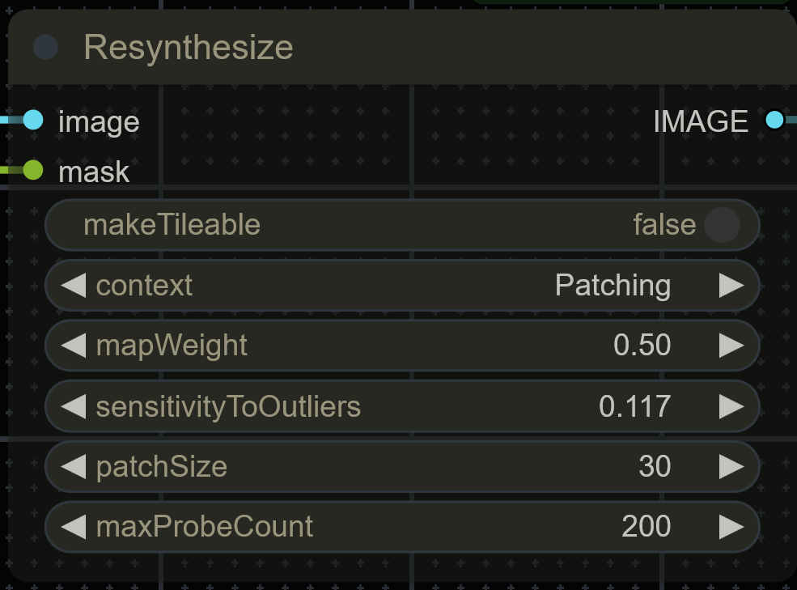
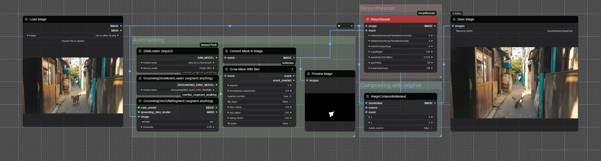

# ComfyUI Resynthesizer
This repository is a quick port of [Resynthesizer](https://github.com/bootchk/resynthesizer) to [ComfyUI](https://github.com/comfyanonymous/ComfyUI).

## Introduction
Resynthesizer is the open-source implementation of a texture generation technique proposed by Paul Harrison in 2005, especially useful for removing an object from an image (inpainting), which is most likely close to what Photoshop uses to for the content aware fill feature. Note that this is not using a diffusion model to inpaint, as opposed to many techniques of today, which makes it very fast and predictable, but sometimes yields worse results.

## Installation
This extension is not available on the manager. To add it to your ComfyUI instance, follow these instructions:
1. Inside your `ComfyUI/custom_nodes/` directory, run the command: `git clone https://github.com/brayevalerien/ComfyUI-resynthesizer`.
2. If you are using a virtual environment (Conda or venv for instance) for ComfyUI, activate it.
3. Install the `resynthesizer` Python library by running: `pip install resynthesizer`.

You should then be able to restart ComfyUI and use this extension. If not, please [open an issue](https://github.com/brayevalerien/ComfyUI-resynthesizer/issues).

## Resynthesizer node

This node simply calls the `resynthesize` function from the `resynthesizer` Python library, handling the image conversion and passing your arguments. The library is poorly documented and I've not experimented a lot or read the actual papers explaining the algorithm so unfortunately I can't document this node properly for now, but I will update this readme to add more info later if possible.

## Example workflow
The following workflow automatically creates a mask according to the prompt given to Segment Anything (a cat in this example) and uses the Resynthesize node from this extension to remove the object.

Drag and drop this image into ComfyUI to open the workflow. It requires the [Segment Anything](https://github.com/storyicon/comfyui_segment_anything) extension in addition to this one.

## References
- [Resynthesizer Python library](https://github.com/light-and-ray/resynthesizer-python-lib)
- [Original Resynthesizer implementation](https://github.com/bootchk/resynthesizer)
- [Paul Harrison's thesis explaining the algorithm](http://www.logarithmic.net/pfh/thesis) (and many other fun stuff about image processing)
- [61315's Resynthesizer](https://github.com/61315/resynthesizer/tree/master) that removes all unecessary stuff from the original implementation (that's what the python lib is using)